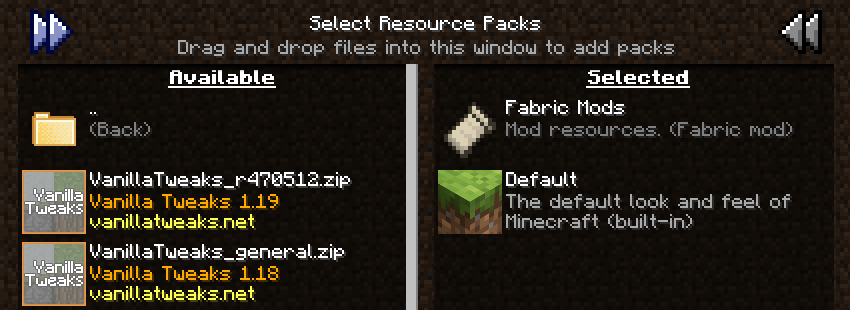
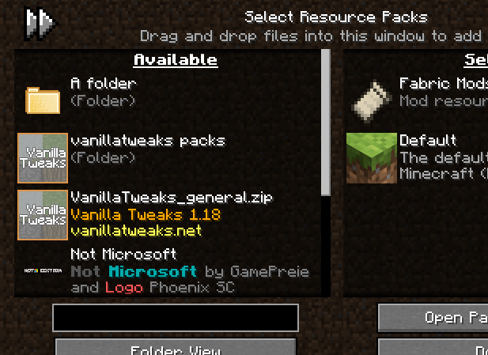

# Recursive Resources 

[![Mod Loader](https://img.shields.io/badge/Mod%20Loader-Fabric-lightyellow?logo=)](https://fabricmc.net)

[](https://discord.gg/WcYsDDQtyR)

[](https://modrinth.com/mod/recursiveresources)
[](https://curseforge.com/minecraft/mc-mods/recursive-resources)

An opinionated port of the [Resource Pack Organiser](https://github.com/chylex/Resource-Pack-Organizer) mod to modern versions of Minecraft.

## Summary

Recursive Resources is a mod that revamps the vanilla resource pack menu to be more friendly to power users
with the addition of many Quality of Life features, such as:

- The ability to organize resource packs into folders that you can navigate within the game
- Extensive folder customization including custom icons, ordering and pseudo-symlinking
- Enabling full folders of resource packs at once, effectively creating "profiles"
- Folder view (navigate in and out of folders) and flat view (packs from all folders shown in a single list)
- Searching pack names and description (with wildcard support)

<div align="center">


</div>

## Features

### Folders

Most of the features in this mod revolve around folders. 
Unlike vanilla, any subfolders you create in the `.minecraft/resourcepacks` folder will be shown ingame,
letting you navigate in and out of them to select packs.
Due to technical limitations, this mod **cannot create or manage folders ingame**, 
this must be done via an external file browser.


Note: Unzipped resource packs **will** still be properly detected and shown in the list as a resource pack.

### Quick enable/disable

You may have noticed the new buttons added to the top of the resource pack list.
These can be used to quickly enable or disable all resource packs in the current folder.
A similar button can also be seen by hovering over the icon of a folder, 
which will enable all packs in that folder.

Packs enabled this way will apply in the order they appear in the folder, 
this order can be customized using the `folder.json` files as described below.




### Folder icons

You can give folders custom icons by placing an image named `icon.png` inside them.
This image will be shown in the resource pack list, and can be used to quickly identify folders.


### folder.json configuration

You've probably seen a file named `folder.json` in the screenshots above,
this file is used to configure some extra properties for the folder it is inside of.
One of these files will be automatically created when you create and enter a new folder.
Opening it up in a text editor, you should see a structure similar to this:

```json
{
  "icon": "icon.png",
  "description": "",
  "packs": [
    "circular hotbar.zip",
    "Not Microsoft"
  ],
  "hidden": false
}
```

These fields represent the following:

- `icon` - The name of the icon file to use for this folder, relative to this folder.
- `description` - A description of the folder, shown under its name.
- `hidden` - Whether or not to hide this folder from the list.

The `packs` field is a little more complicated.
It contains a list of all packs in the current folder, in the order in which they'll be displayed and applied.
While you can reorder these as you please, 
removing one will cause it to be added back automatically so long as its file is still in the folder.

### Pseudo-symlinks

In some cases, you may want to have a pack appear in multiple folders at once.
While you could just copy the pack, this would use twice the disk space, and might be impractical.
This is why the `packs` field in the `folder.json` supports referencing packs outside of the current folder.

For example, you could modify the `folder.json` from the above examples like this:

```json
{
  "icon": "icon.png",
  "description": "",
  "packs": [
    "vanillatweaks packs/VanillaTweaks_general.zip",
    "circular hotbar.zip",
    "Not Microsoft"
  ],
  "hidden": false
}
```

This would cause the `VanillaTweaks_general.zip` pack to appear in 
both the `vanillatweaks packs` folder and the current folder:



## License

This mod is under the [Mozilla Public License](LICENSE), version 2.0
